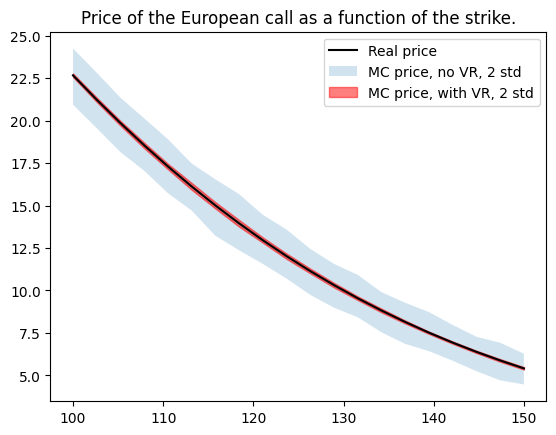
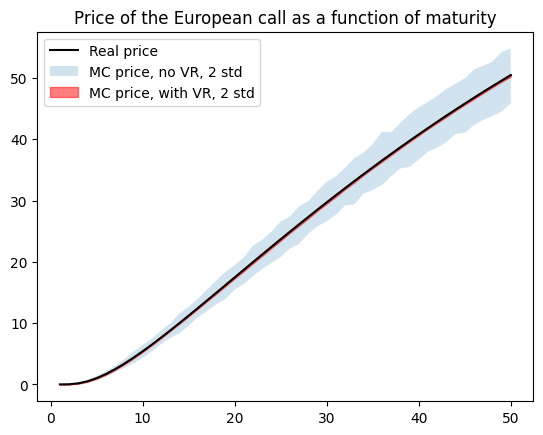
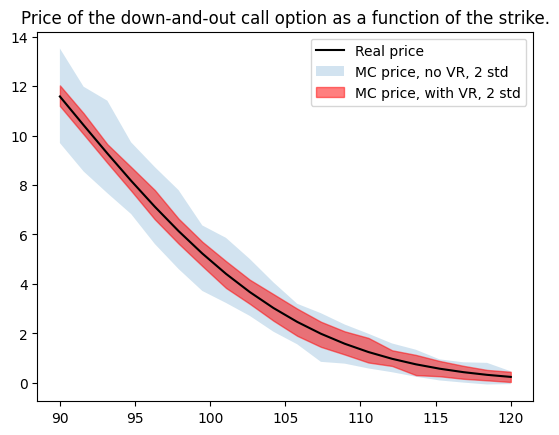
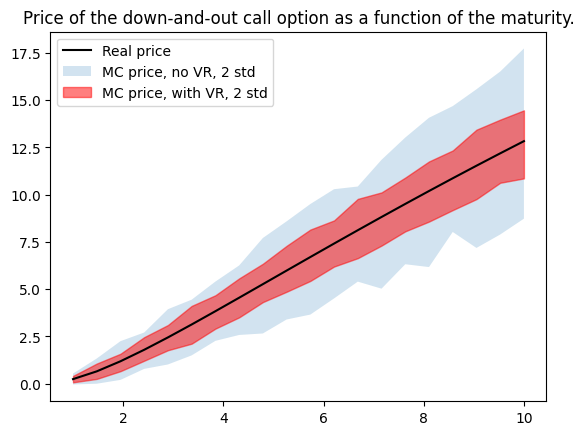

# Option pricing

This contains several functions to compute the price of vanilla and exotic options using Monte Carlo methods. We compare prices obtained
- analytically;
- with MC methods;
- with MC methods implementing variance reduction techniques.

This README summarizes the results obtained. The calculations and functions are described in more details in the simulation [notebook](simulations.ipynb).

The variance reduction techniques we implement are described in Art Owen's [course](https://artowen.su.domains/mc/Ch-var-basic.pdf), specifically antithetic sampling and moment matching. In all the following:
- $S_0$ is the initial price of the underlying, fixed at $100$
- $r$ the interest rate, fixed at $2\%$
- $\sigma$ is the volatilty, fixed at $10%$

We will use different maturities $T$ and strike $K$.

# European call option

First fix $T = 10$ and $K = 150$. The price of the option obtained with Black-Scholes formula is $5.4098$. With MC methods, and different variance reduction techniques, we obtain the following. We used $1000$ samples to compute expectations, and repeated $100$ times to estimate variances.

| Antithetic | Moment matching | Price estimate | Variance |   |
|------------|-----------------|----------------|----------|---|
| False      | False           | 5.4715         | 0.4564   |   |
| True       | False           | 5.3888         | 0.3038   |   |
| False      | True            | 5.4242         | 0.1902   |   |
| True       | True            | 5.4020         | 0.0442   |   |

Clearly, the variance reduction methods work very well!

We can also graph what happens for different strikes or maturities. In the following pictures, the real (analytic) price is the black curve, the blue area represents two standard deviations for MC estimation, and the red area is the same but with both variance reduction techniques used. The improvement is again obvious. Note also that implementing these techniques result in only a marginal augmentation of computational time.

  
&nbsp; &nbsp;
  

Corresponding variances, averaged over all values of the strike / maturity, are as follows.

| Variable | Variance reduction |Variance |
|------------|-----------------|-------------------|
| Strike      | False           | 0.6787   | 
| Strike      | True            |  0.0631   | 
| Maturity    | False            |  1.285   | 
| Maturity    | True            |  0.0729   | 

# Barrier option

We now investigate the down-and-out call option, which expires if the underlying goes below a certain barrier. Here, we assume barrier < strike (this does not matter for the MC estimation, but it does for the analytic formula).

First fix $T = 10$, $K = 150$ (strike), and $H = 90$ (barrier). The price of the option obtained with Black-Scholes formula is $4.4071$. It is less than the price of the European call above ($5.4098$) since the latter is less restrictive than the barrier option.

With MC methods, and different variance reduction techniques, we obtain the following. We used $100$ samples to compute expectations, discretized the time-interval in $10,000$ steps, and repeated $100$ times to estimate variances. Note that it is quite important to split the time-interval enough times. Otherwise, we underestimate the proportion of times that the option is knocked-out, and thus get an overestimate of the price.

| Antithetic | Moment matching | Price estimate | Variance |
|------------|-----------------|----------------|----------|
| False      | False           | 4.3109         | 1.4778   |
| True       | False           | 4.4658         | 0.9562   |
| False      | True            | 4.3744         | 1.0015   |
| True       | True            | 4.4879         | 0.7613   |

Then again, we see a improvement with variance reduction techniques, but is much less prominent. Let us see this graphically. Here, we took $T=1$ to avoid excessive computational times, as $T=10$ would require many time steps.

  
&nbsp; &nbsp;
  

A small silver lining here is that the variance reduction techniques help more when we are *out of the money*.

# Further studies

## Other variance reduction methods

To further improve the results, other techniques should be investigated, for instance using a *stratified Brownian motion*.

## Other options

The code can be easily modified to compute prices for a whole variety of options, such as Asian options.